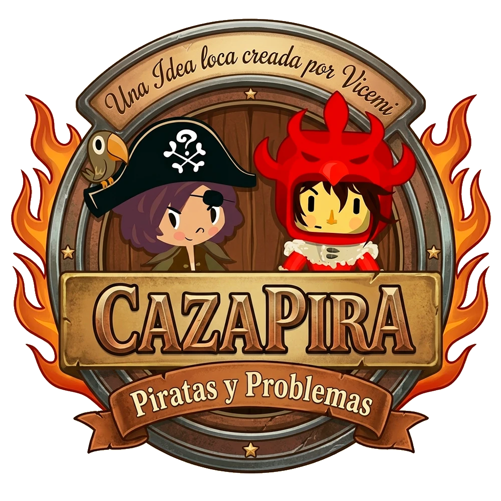

<p align="center"></p>

# CazaPira: Piratas y Problemas

**Jugalo en: [cazapiru.vicemi.dev](https://cazapiru.vicemi.dev)**

CazaPira nació de una idea que me dio una amiga: mezclar dos grandes juegos educativos uruguayos, **Piracálculos** y **Los Cazaproblemas**, y crear con ellos una nueva historia alternativa y mejorada. Une sus mecánicas, sus historias y sus personajes con matemática, lógica y aventura.

Es una versión web (Astro + React + Canvas) que funciona en computadora y en celular, con controles táctiles.

* **Los Cazaproblemas: Torneo de Campeones** (Plan Ceibal, CPM, Trojan Chicken) aporta el mundo: la Academia, Logiverum, el bosque y las montañas de Terragrifus, 116 problemas, el diario, el mapa y el Torneo.
* **Piracálculos** (Plan Ceibal, Batoví, Campeón) aporta seis minijuegos de piratas: llaves y candados, saltos en la cueva, estiba de cajones, la bodega a oscuras, el tablero de dados y el duelo contra Olivera.

## La historia

**Prólogo (una historieta de tres páginas, igual para los dos héroes)**

1. **Dos lunas.** Terragrifus tiene dos lunas: Serélia, blanca y grande, y Syrëlia, azul y pequeña, de la que cae el Vis. Gladius, el Príncipe Cazador, construyó una catapulta para esconder la luna azul. Para todos, falló, y lo exiliaron. El Vis se derramó entonces sobre el Mar de los Números, donde manda Olivera, un pirata codicioso y malvado.
2. **Dos destinos.** Aki, hijo de Gladius, recibe una carta de Quimerius y entra a la Academia de Cazaproblemas. En el mar, Gladius crió a Pi, capitán de la Cólera Escarlata. Un día desapareció y le dejó una carta y un mapa en clave de números que lleva al último Vis. Olivera captura a Pi y le roba el mapa.
3. **El portal.** Pi y su loro Flo escapan y cruzan un portal de Vis abierto por el eclipse. El mar se pliega sobre Terragrifus y los deja caer sobre la Fuente de la Academia, donde Aki, que no podía dormir, mira las lunas.

**Dos caminos.** En la Fuente se reconocen como casi hermanos: Gladius es el padre de Aki y crió a Pi. Quimerius les explica que solo un Cazaproblemas puede cerrar los cinco **Ecos** (pedazos del mar llenos de trampas de Olivera) y acercarse a la Fuente, así que los dos deben graduarse. La Academia admite un solo aprendiz nuevo por año: el héroe que elegís estudia en las Torres y el otro se vuelve **aprendiz de campo**.

**El otro héroe aparece en la historia.** Como en Pokémon, el que no elegiste aparece en momentos clave para contarte cómo avanza su búsqueda:

* en las Torres;
* cuando recibís el diploma;
* al llegar a Logiverum;
* en las montañas;
* cuando se descubre la Orden secreta;
* en la Fuente.

También te espera junto a cada Eco abierto para entrar juntos.

**La verdad y los dos jefes.** La aventura original sigue igual: las Torres, el diploma, Logiverum, Farsantius, Aurelia, la Orden y el plano de Armandius. La pista final es que la catapulta apuntó bien, porque Gladius escondió la luna a propósito y custodia el último Vis bajo la Fuente. Allí esperan dos jefes, uno de cada juego:

* **Quimerius, el Sabio** (Cazaproblemas), en el *Duelo del Sabio*: cinco problemas con las mecánicas de ambos juegos.
* **Olivera** (Piracálculos). Nunca pudo leer su mapa en clave y dejó que los héroes resolvieran los problemas por él.

Hay dos finales: el verdadero si cerraste los cinco Ecos y uno parcial si faltan.

## Qué se mezcló

* **Ecos:** cinco portales que se abren con la historia. Cada uno es un nivel de Piracálculos, del 1 al 5, con diálogos y recompensas.
* **Criaturas del mar en Terragrifus:** el Dado Rodante, la Calavera del Cofre y el Pirata Ronco te desafían a **duelos de cálculo**. Los duelos mezclan llave y candado, cajones del muelle, dado oculto, perímetro y área, repartos, tablas y series.
* **Dificultad:**
  * *Normal* usa los problemas de 5.º de primaria. Los duelos dan más tiempo y la pista aparece sola; en los problemas, la primera pista es gratis.
  * *Difícil* usa los problemas de 6.º de primaria.
* **Tipografías de los dos juegos:** la Futura de Cazaproblemas en la interfaz y la fuente bitmap de Piracálculos en el HUD pirata, los duelos y los títulos.
* **Atuendos:** los cuatro atuendos de Cazaproblemas (Uniforme, Abrigo, Brad y Sombra) se consiguen igual que en el original y los usa el héroe que elegiste: Aki con los trajes originales, Pi con una versión recoloreada de sus propios dibujos. El otro héroe mantiene siempre su aspecto original.
* **Presentación:** logo propio, menú con los dos mundos lado a lado, prólogo en historieta y portal de Vis animado.

## Controles

* **Movimiento:** flechas o WASD. Con mouse o dedo, mantené apretado sobre el mapa.
* **Espacio:** hablar, usar o aceptar.
* **C:** consola (diario, mapa, objetos y Ecos).
* **Esc:** pausa o volver.
* **H:** pista en los duelos.
* **Celular:** joystick y botones en pantalla. Conviene jugar con el teléfono girado.

## Cómo compilarlo

El repositorio incluye todo lo necesario para jugar: el código y los recursos ya convertidos en `public/assets/` (imágenes, sonidos, música, mapas, scripts, problemas y fuentes). No hace falta tener los juegos originales.

```bash
npm install
npm run dev        # servidor de desarrollo
npm run build      # versión para publicar (carpeta dist/)
```

Requiere Node 22 o superior. Para publicar, alcanza con subir la carpeta `dist/` a cualquier hosting estático.

Las herramientas de `tools/` (Python 3 con Pillow) muestran cómo se convirtieron los recursos desde los juegos originales y permiten regenerarlos:

```bash
python tools/decrypt_puzzles.py "<Cazaproblemas>/data/puzzles/puzzles.enc" "<Cazaproblemas>/Cazaproblemas.exe"
python tools/build_caza.py "<Cazaproblemas>/data"
python tools/build_pira.py "<Piracalculos>/Piracalculos.activity/assets"
python tools/build_pixfont.py
```

El motor de Cazaproblemas está reimplementado y ejecuta los scripts Lua originales con una máquina virtual de Lua 5.1 propia (`src/game/caza/lua51.ts`). Los niveles de Piracálculos se reescribieron sobre sus gráficos y sonidos.

## Créditos

* **Vicemi Dev:** mod CazaPira, fusión de mundos, nueva historia, mecánicas mixtas, adaptación web y móvil. La idea de mezclar los dos juegos surgió de una amiga. Programado con ayuda de IA (Claude Code).
* **Los Cazaproblemas: Torneo de Campeones:** Plan Ceibal, CPM y Trojan Chicken; arte, mundo, personajes, guion, problemas y música originales.
* **Piracálculos:**
  * Idea original: Laura Alvarez, Patricia Hernández y Fabián Rodríguez.
  * Producción ejecutiva: Plan Ceibal.
  * Producción y diseño: Campeón.
  * Programación: Batoví (Gonzalo Ordeix).
  * Audio: F.A.M.

CazaPira es un proyecto de fans sin fines de lucro. Los juegos originales, sus personajes y sus recursos pertenecen a sus autores y dueños.
